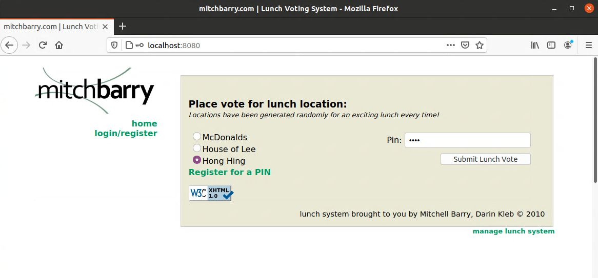
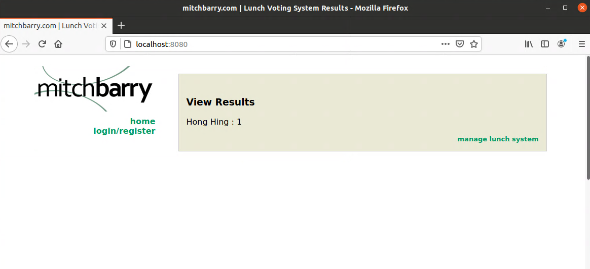

# Lunch Voting System (LVS)

Created by Mitchell Barry and Darin Kleb in 2010.

Purpose: Help a rag-tag group of interns decide where to eat lunch on Friday each week. 





Original source with very minor adjustments to run in containers and allow configuration.

[This tutorial](https://www.vultr.com/docs/deploy-a-php-application-using-docker-compose) was used to get started.

## Configuring

- Environment Variables
  - `HOSTNAME`
    - _default_: `http://localhost:8080`
    - _example_: `https://lvs.mydomain.com`
    - Hostname used within links of application

- Mail-specific Environment Variables
  - > These are optional if you intend to create PIN registrations and have the "full experience". 
  - `MAIL_HOST`
    - _default_: `smtp.mailgun.com`
    - Your mailing host
  - `MAIL_PORT`
    - _default_: `587`
    - Which port to connect to mailing host
  - `MAIL_USER`
    - _default_: none
    - User needed to authenticate with mail service
  - `MAIL_PASS`
    - _default_: none
    - Password needed to authenticate with mail service
  - `MAIL_FROM`
    - _default_: none
    - _example_: `lunch@mydomain.com`
    - Email address recipients would see the automated alerts coming from
  - `ADMIN_EMAIL`
    - _default_: none
    - _example_: `admin@mydomain.com`
    - Email that receives the PIN requests to approve/deny

To set these variables, use one of these methods:

### Configuring with `.env` file

This is defined in docker documentation [here](https://docs.docker.com/compose/env-file/).

```bash
# in /app folder
vim .env
```

```ini
# App configuration
HOSTNAME=http://localhost:8080

# SMTP configuration
MAIL_HOST=smtp.mailgun.com
MAIL_PORT=587
MAIL_FROM=lunch@mydomain.com
MAIL_USER=myuser@mydomain.com
MAIL_PASS=abcdefghijklmnop
ADMIN_EMAIL=admin@domain.com
```

Alternatively, to set these variables from the command line, follow this syntax:

```bash
# macos, linux
export HOSTNAME=http://localhost:8080
export MAIL_FROM=lunch@mydomain.com
export MAIL_USER=myuser@mydomain.com
export MAIL_PASS=abcdefghijklmnop
export ADMIN_EMAIL=admin@domain.com
```

## Running

```bash
# pwd: repository root

# first, locally build some images needed
docker build -t lvs-php php/
docker build -t lvs-nginx nginx/
docker build -t lvs-cron cron/

cd app/

# confirm configurations in docker-compose.yml
docker-compose up -d

# open http://localhost:8080/
```

## Notes
- So many SQL injection vulnerabilities!
- Had to update all `mysql` calls to use [PHP Data Objects (PDO)](https://www.php.net/manual/en/book.pdo.php) instead. Apparently the `mysql` calls were deprecated years ago... 
- The _Lunch Voting System_ had some integration with a CMS system hosted on mitchbarry.com - administrators of the _Lunch Voting System_ needed a user created in that system. To self-contain, that user administration has moved to the same mysql database that the application depends on. 
  - Admin User: `admin`
  - Admin Pass: `admin`
  - Fun non-admin User: `user`
  - Fun non-admin Pass: `user`
- I had issues with `/start.php` not writing the `index.php` file out. This impacts cron job not writing new `index.php` as well, of course.
  ```bash
  # security be damned
  chmod 777 ./app/index.php
  chmod 777 ./app/lastweek.php
  chmod 777 ./app/restaurant.pl
  ```
- Cron container runs schedule on **Fridays**:
  - Sets up index page at **7AM** with fresh **voting options**
  - Sends **reminder email** to all registered users at **8AM**
  - Sends **vote results** at **11AM**
  - Resets the index page at **2PM** to indicate voting is over and to **wait until next week**.

## To Do
- Restaurants pulled from database instead of text files would obviously be better.
- One-off container building required to run services should be streamlined as well to not require local building first...

## Debugging

To get into mysql container host to run `mysql` tool and poke around, you'll need to get the container id. 

```bash
docker ps
# assume b7a9f5eb6b85 is the CONTAINER_ID of the lvs-data instance
docker exec -it b7a sh
```

## Schema

View [00-init.sql](./app/sql/00-init.sql) to see database schema. 

To populate your own test data, update [01-seed.sql](./app/sql/01-seed.sql).
